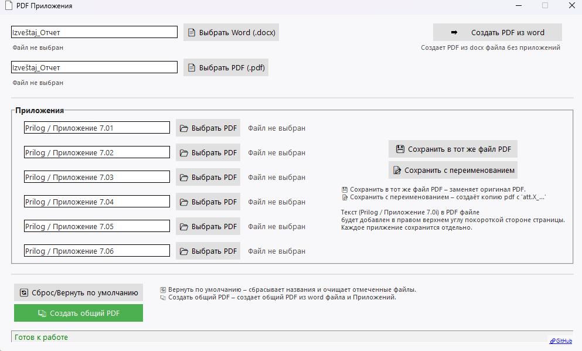

# Инструкция по использованию .exe-версии программы PDF Приложения

> Программа «PDF Приложения» — простой GUI-инструмент для добавления подписи (например, «Приложение 7.01») в правый верхний угол PDF-документа. Поддерживается одновременная обработка до шести PDF-файлов и конвертация Word → PDF.



## Как пользоваться .exe-версией

1.  **Запуск**
    - Дважды щёлкните по файлу `PDF_Приложения.exe`.
2.  **Переименование приложений**
    - Введите текст подписи в каждом из четырёх полей (по желанию можно оставить только нужные).
    - *Пример: «Prilog / Приложение 7.01»*
3.  **Выбор PDF-файлов**
    - Нажмите кнопку «Выбрать PDF» напротив каждого поля.
    - Укажите файл на компьютере.
4.  **Опции сохранения**
    - **Сохранить в тот же файл** — перезапишет оригинал.
    - **Сохранить с переименованием** — создаст копию с префиксом `att.X_...` (где Х – номер поля).
5.  **Конвертация Word → PDF**
    - При необходимости выберите Word-файл `.docx` и нажмите «Создать PDF из Word».
    - Полученный PDF можно сразу включить в объединённый файл (см. ниже).
6.  **Создание общего PDF**
    - Нажмите «Создать общий PDF» для объединения PDF-приложения(ий) и (опционально) конвертированного Word-документа.
    - Укажите имя и место сохранения итогового файла.
7.  **Готово!**
    - После успешной обработки в строке состояния появится уведомление.
    - Для быстрого открытия созданного PDF кликните по ссылке «Открыть ...».

## Примечания

- Текст добавляется в правый верхний угол по короткой стороне страницы.
- Если необходимо сбросить все поля и пути к файлам — нажмите «Сброс/Вернуть по умолчанию».

## Сборка исполняемого файла

Для создания исполняемого файла (`.exe`) из исходного кода используйте `PyInstaller`. Убедитесь, что у вас установлен `PyInstaller` (`pip install pyinstaller`).

Выполните следующую команду в корневой директории проекта:

```bash
pyinstaller --noconsole --onefile --icon=assets/icon.ico --add-data "assets;assets" pdf_attachments_ui.py
```

Эта команда скомпилирует приложение в один исполняемый файл без консольного окна, используя `icon.ico` в качестве иконки и включая все необходимые ресурсы из папки `assets`.

**Примечание:** Текущая версия сборки, соответствующая этим изменениям, может быть обозначена как `v3.2`.