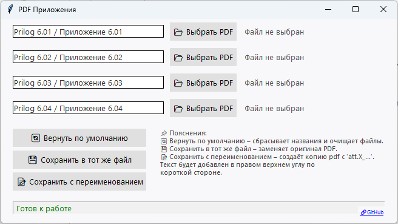

# Вставка текста (Приложения...) в PDF

Простая настольная программа на Python для автоматического добавления текста (например, "Приложение 6.01") в правый верхний угол PDF-документов.

## Возможности

- Обработка до 4 PDF-файлов одновременно
- Выбор наименования приложения вручную
- Сохранение в тот же файл или копию с префиксом `att.X_`
- Минималистичный интерфейс в стиле Headspace
- Кнопка сброса всех настроек

## Скриншот



## Установка

Установите зависимости:

```bash
pip install PyPDF2 reportlab
