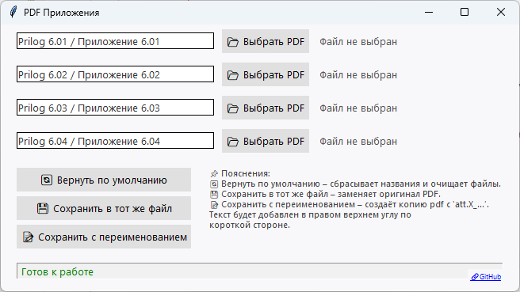

# PDF Attachments Tool

Инструмент для работы с PDF-файлами и документами Word.

## Основные возможности

- **Конвертация Word в PDF**: Преобразование `.docx` файлов в PDF.
- **Обработка PDF-приложений**: Добавление настраиваемого текста (например, "Приложение 7.01") в верхний угол страниц PDF. Корректно работает с портретной и альбомной ориентацией.
- **Объединение документов**: Создание единого PDF-файла из основного документа (конвертированного из Word) и нескольких PDF-приложений.

## Системные требования

- Windows 7/8/10/11
- Установленный Microsoft Word (для конвертации `.docx`)

## Установка и запуск

1.  **Скачайте архив**: Загрузите последнюю версию со страницы [релизов](https://github.com/Dun4ev/pdf-attachments-tool).
2.  **Распакуйте**: Извлеките файлы из архива в любую папку.
3.  **Запустите**: Откройте `pdf_attachments_ui.exe`.

> Для разработчиков: можно также запустить из исходного кода, установив зависимости из `requirements.txt`.

## Как использовать

### 1. Конвертация Word в PDF (опционально)

- Нажмите **"📄 Выбрать Word (.docx)"**, чтобы выбрать основной документ.
- При необходимости измените имя будущего PDF в текстовом поле.
- Нажмите **"➡️ Создать PDF из word"**. Рядом с кнопкой появится ссылка на созданный файл.

### 2. Добавление PDF-приложений

- Для каждого приложения (до 4-х) нажмите **"📂 Выбрать PDF"**.
- В текстовом поле слева можно изменить текст, который будет добавлен на страницы приложения (по умолчанию "Prilog / Приложение 7.0X").
- Чтобы сохранить изменения только в файлах приложений, используйте кнопки:
    - **"💾 Сохранить в тот же файл PDF"**: Перезаписывает исходный файл.
    - **"📝 Сохранить с переименованием"**: Создает копию с префиксом `att.X_`.

### 3. Создание общего PDF

- После выбора основного Word-файла и/или PDF-приложений нажмите **"📚 Создать общий PDF"**.
- Программа сначала обработает и добавит текст во все приложения, а затем объединит их с основным документом в один файл.
- Вам будет предложено выбрать имя и место для сохранения итогового файла.

---

Проект использует [PyPDF2](https://pypdf2.readthedocs.io/), [ReportLab](https://www.reportlab.com/) и [docx2pdf](https://github.com/AlJohri/docx2pdf).
