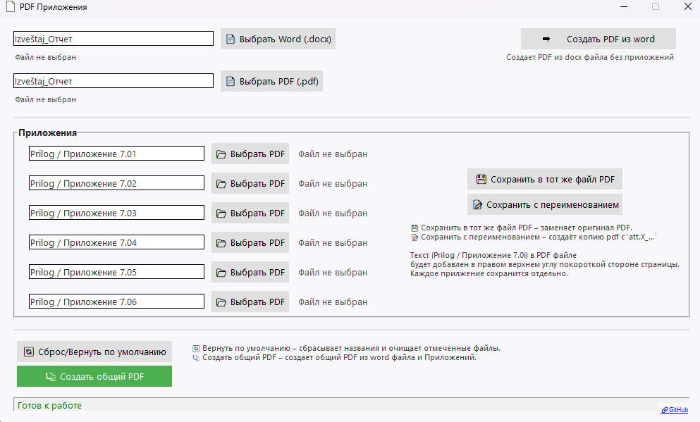

# PDF Attachments Tool (v3.2)

Инструмент для автоматизации работы с PDF-файлами и документами Word.

## Основные возможности

- **Выбор основного отчета**: Работайте с главным документом в формате `.docx` или `.pdf`.
- **Конвертация Word в PDF**: Быстрое преобразование `.docx` файлов в PDF.
- **Обработка PDF-приложений**: Добавление настраиваемого текста (например, "Приложение 7.01") в верхний угол страниц для **6 приложений**. Утилита корректно обрабатывает портретную и альбомную ориентацию.
- **Объединение документов**: Создание единого PDF-файла из основного отчета (Word или PDF) и нескольких PDF-приложений.

## Системные требования

- Windows 7/8/10/11
- Установленный Microsoft Word (требуется для конвертации `.docx` в `.pdf`)

## Установка и запуск

1.  **Скачайте архив**: Загрузите последнюю версию со страницы [релизов](https://github.com/Dun4ev/pdf-attachments-tool/releases).
2.  **Распакуйте**: Извлеките файлы из архива в любую папку.
3.  **Запустите**: Откройте `pdf_attachments_ui.exe`.

> Для разработчиков: можно также запустить из исходного кода, установив зависимости из `requirements.txt`. Инструкции по сборке исполняемого файла (`.exe`) доступны в [MANUAL.md](MANUAL.md).

## Как использовать

### 1. Выбор основного отчета

Вы можете использовать в качестве основного документа либо Word-файл, либо уже готовый PDF-файл.

#### Вариант А: Word-документ

1.  Нажмите **"📄 Выбрать Word (.docx)"**, чтобы выбрать основной документ.
2.  При необходимости измените имя будущего PDF в текстовом поле.
3.  *Опционально*: если вам нужен только PDF этого документа без приложений, нажмите **"➡️ Создать PDF из word"**. Рядом с кнопкой появится ссылка на созданный файл.

#### Вариант Б: PDF-документ

1.  Нажмите **"📄 Выбрать PDF (.pdf)"**, чтобы выбрать основной отчет в формате PDF.
2.  Имя файла будет использовано при создании общего PDF.

> **Примечание**: Если выбраны и Word, и PDF отчеты, при создании общего PDF будет использоваться **только PDF-отчет**.

### 2. Добавление PDF-приложений

- Для каждого из **6 приложений** нажмите **"📂 Выбрать PDF"**.
- В текстовом поле слева можно изменить текст, который будет добавлен на страницы приложения (по умолчанию "Prilog / Приложение 7.0X").
- Чтобы сохранить изменения только в файлах приложений (без объединения с основным отчетом), используйте кнопки:
    - **"💾 Сохранить в тот же файл PDF"**: Перезаписывает исходный файл приложения.
    - **"📝 Сохранить с переименованием"**: Создает копию с префиксом `att.X_`.

### 3. Создание общего PDF

1.  Убедитесь, что вы выбрали основной отчет (Word или PDF) и необходимые PDF-приложения.
2.  Нажмите зеленую кнопку **"📚 Создать общий PDF"**.
3.  Программа сначала обработает и добавит текст во все приложения, а затем объединит их с основным документом в один файл.
4.  Вам будет предложено выбрать имя и место для сохранения итогового файла.

### 4. Дополнительные функции

- **"🔄 Сброс/Вернуть по умолчанию"**: Эта кнопка очищает все выбранные файлы и возвращает текстовые поля к значениям по умолчанию.

---

Проект использует [pypdf](https://pypdf.readthedocs.io/), [ReportLab](https://www.reportlab.com/), [docx2pdf](https://github.com/AlJohri/docx2pdf) и `tkinter`.

## Решение проблем

В процессе разработки и сборки могут возникать специфические ошибки. Здесь описаны некоторые из них и методы их решения.

### 1. Текст штампа не виден после сохранения PDF (Исправлено в v3.2)

*   **Симптомы:**
    *   После добавления штампа в PDF-приложение, текст штампа (например, "Приложение 7.01") не отображается в программах для просмотра PDF.
    *   При этом, если открыть PDF в редакторе, можно выделить пустую область, где должен быть текст, и после смены цвета он появляется.

*   **Причина:**
    *   Проблема заключалась в устаревшей библиотеке `PyPDF2`, которая использовалась для слияния PDF-файлов. Она содержала ошибку, из-за которой текстовые объекты при слиянии превращались в невидимые векторные фигуры.

*   **Решение:**
    *   Проект был переведен с `PyPDF2` на ее современный и активно поддерживаемый аналог — `pypdf`. Это полностью решило проблему некорректного слияния и обеспечило корректное отображение текста.

### 2. Ошибка при запуске `.exe`: `'NoneType' object has no attribute 'write'`

*   **Симптомы:**
    *   Скомпилированный `.exe`-файл, созданный с опцией `--windowed`, аварийно завершает работу сразу после запуска или при выполнении операции конвертации Word в PDF.
    *   Иногда на мгновение появляется черное окно консоли и тут же исчезает.
    *   Может появиться окно с ошибкой, содержащей текст `Word: 'NoneType' object has no attribute write`.

*   **Причина:**
    Графические приложения, собранные в режиме `--windowed`, не имеют консоли. В результате стандартные потоки вывода (`sys.stdout` и `sys.stderr`) в коде имеют значение `None`. Некоторые библиотеки (в данном случае `docx2pdf`) пытаются вывести в эти потоки служебную информацию. Попытка записи в объект `None` вызывает ошибку `AttributeError` и приводит к падению программы.

*   **Решение:**
    В главный файл скрипта (`pdf_attachments_ui.py`) был добавлен специальный блок кода. Этот код выполняет следующие действия в самом начале работы программы:
    1.  Проверяет, запущена ли программа как скомпилированный `.exe`-файл (`getattr(sys, 'frozen', False)`).
    2.  Если да, и если потоки вывода `sys.stdout` или `sys.stderr` отсутствуют (`None`), он перенаправляет их в лог-файл (например, `pdf_attachments_ui.log`), который создается в той же папке, что и `.exe`.
    
    Это "ловит" все попытки записи в консоль и вместо падения программы безопасно сохраняет их в файл. Это не только решает проблему сбоя, но и обеспечивает логирование для будущей отладки.

### 3. Ошибка при сборке `.exe`: `PermissionError: [WinError 5] Отказано в доступе`

*   **Симптомы:**
    *   Выполнение команды `pyinstaller` прерывается с ошибкой `PermissionError`.
    *   В тексте ошибки указано, что нет доступа к `.exe`-файлу в папке `dist`.

*   **Причина:**
    PyInstaller по умолчанию пытается сначала удалить старый исполняемый файл перед созданием нового. Эта ошибка возникает, если старый `.exe`-файл заблокирован, потому что **он все еще запущен в фоновом режиме** (даже если его окно закрыто).

*   **Решение:**
    *   **Вариант А (простой):** Перед запуском сборки вручную **удалить всю папку `dist`**.
    *   **Вариант Б (технический):** Открыть "Диспетчер задач" (`Ctrl+Shift+Esc`), перейти на вкладку "Подробности", найти процесс по имени вашего `.exe`-файла (например, `pdf_attachments_ui_v3.1.exe`), выделить его и нажать "Снять задачу".

После выполнения одного из этих действий повторная сборка должна пройти успешно.