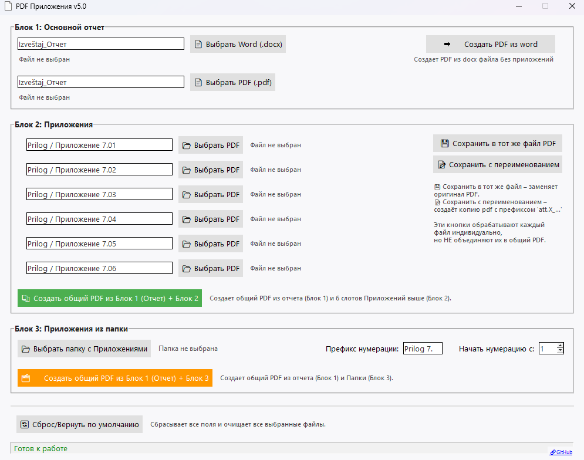

# PDF Attachments Tool (v5.0)

Инструмент с графическим интерфейсом для комплексной работы с PDF-документами. Позволяет добавлять текстовые штампы, конвертировать `.docx` в `.pdf`, объединять несколько документов в один и автоматически создавать для него многоуровневое оглавление.



## Основные возможности

- **Выбор основного отчета**: Работает как с Word (`.docx`), так и с PDF (`.pdf`) файлами в качестве основы для сборки.
- **Конвертация Word → PDF**: Интеграция с Microsoft Word для преобразования документов.
- **Продвинутое штампование**: Добавляет текстовые метки на каждую страницу PDF-приложений. Алгоритм корректно обрабатывает ориентацию, повороты (`/Rotate`) и размеры (`/CropBox`) страниц, адаптируя положение штампа.
- **Два режима объединения документов**:
    - **Ручной выбор**: Сборка отчета и до 6 PDF-приложений, выбранных индивидуально.
    - **Сборка из папки**: Автоматическое объединение отчета со всеми PDF-файлами из указанной директории.
- **Генерация оглавления (TOC)**: Автоматически создает иерархическое оглавление (закладки) в объединенном PDF, сохраняя при этом исходные закладки из каждого документа.

## Технические детали

Проект построен на стеке следующих библиотек:
- **GUI**: `tkinter`.
- **Работа с PDF**: 
    - `pypdf`: Основная библиотека для чтения, записи и объединения PDF-страниц. Проект мигрировал с `PyPDF2` для решения проблем рендеринга текста.
    - `reportlab`: Используется для генерации векторного PDF-штампа.
    - `pdf_attachments.bookmarks` (на базе `PyMuPDF`): Модуль для извлечения и записи метаданных оглавления (TOC).
- **Конвертация**: `docx2pdf` (использует COM-интерфейс Microsoft Word).

### Логика создания оглавления

При создании общего PDF-файла скрипт выполняет следующие шаги:
1.  Извлекает существующие закладки из файла отчета и каждого файла-приложения с помощью `PyMuPDF`.
2.  Формирует новое, двухуровневое оглавление:
    - Первый уровень: `Izvestaj` (Отчет) и `Prilog X` (Приложение X).
    - Второй уровень: Внутрь каждого элемента первого уровня вкладываются исходные закладки соответствующего документа.
3.  Записывает сгенерированное оглавление в метаданные итогового PDF.

## Установка и запуск (для разработчиков)

1.  **Клонируйте репозиторий**
2.  **Создайте и активируйте виртуальное окружение**:
    ```bash
    python -m venv .venv
    # Windows
    .venv\Scripts\activate
    # macOS/Linux
    source .venv/bin/activate
    ```
3.  **Установите зависимости**:
    ```bash
    pip install -r requirements.txt
    ```
    Ключевые зависимости: `pypdf`, `reportlab`, `docx2pdf`, `PyMuPDF`.

4.  **Запустите приложение**:
    ```bash
    python pdf_attachments_ui.py
    ```

### Сборка .exe

Для сборки исполняемого файла используется `PyInstaller`. Спецификация сборки находится в файле `pdf_attachments_ui.spec`. Команда для сборки:

```bash
pyinstaller pdf_attachments_ui.spec
```

## История улучшений

- **v5.0 (2025-09-23)**:
    - **Исправлено:** Устранена проблема с обрезанием длинных имен файлов в режиме "Приложения из папки". Теперь имя файла на штампе корректно сокращается, а в закладках остается полным.
    - **Исправлено:** Устранена ошибка, из-за которой поле "Начать нумерацию с" по умолчанию имело значение "11" вместо "1".
    - **Улучшено:** Кнопка "Сброс" теперь также сбрасывает поля нумерации и префикса в блоке "Приложения из папки".
- **v4.0**: Добавлена функция генерации многоуровневого оглавления. Реализована возможность использовать существующий PDF как основной отчет. Переработан UI.
- **v3.2**: Улучшен алгоритм позиционирования штампа для страниц с нестандартным поворотом (`/Rotate=270`).
- **v3.0**: Проект переведен с `PyPDF2` на `pypdf`, что решило проблему с невидимым текстом в штампах.